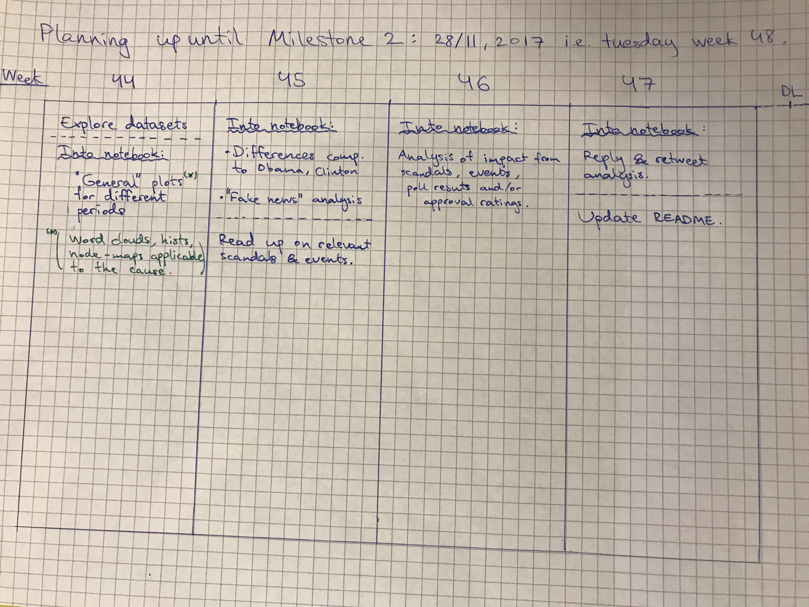

# A Title
Boring but descriptive or more catchy?  
* The Tweeting Trump  
* Trump's Twitter Fingers  
* Analysing Trump's Tweets?  

# Abstract
_A 150 word description of the project idea, goals, dataset used. What story you would like to tell and why? What's the motivation behind your project?_

The core idea is to thoroughly explore rhetoric (e.g. word usage) in the Trump Twitter Archive dataset. We would like to explore the change over time and how certain events affects it.

More specifically, we want analyse the change before and after he announced his presidential candidacy and before and after the election. In addition these long-period analytics, we would also like to explore the change in rhetoric incurred by related political scandals or major international events. Lastly, we would also like to compare Trump's rhetoric with Clinton's and Obama's.

Motivation behind project?  
Curiosity maybe?


# Research questions
_A list of research questions you would like to address during the project._ 

We would like to answer/explore the following:  

* Word usage type of tweet in three periods:
    * Before presidential candidacy announcement, first tweet to 16/06/2015.  
    * Before election, 16/06/2015 to 8/11/2016.  
    * After election, 8/11/2016 to now.  

* Are there any change in word usage and/or rhetoric in connected to poll results?

* Are there any change in word usage and/or rhetoric in connected to major events and scandals?
  E.g. Panama Papers, Clinton e-mails, and so on.

* Differences and similarities in word usage and rhetoric compared to other politicians, e.g. Clinton, Obama, or republican nominee opponents.

* Analyse his retweets and replies.  
  E.g. while he mostly retweet right-wing content (true?), does he reply to users from both sides of the political spectum?  
  How does the word usage in his replies differ from his normal tweets?

* When did the phrase "Fake News" arise? Explore usage frequency connection to scandals.


# Dataset
_List the dataset(s) you want to use, and some ideas on how do you expect to get, manage, process and enrich it/them. Show us you've read the docs and some examples, and you've a clear idea on what to expect. Discuss data size and format if relevant._

#### Main Dataset  
*[Trump Twitter Archive](https://github.com/bpb27/trump_tweet_data_archive)*  
Size ~2GB. Updated hourly. We will probably use the condensed version of the tweet data. But we will also at least take a look at the full version and see if we can extract some extra information from it.

Example from condensed dataset (formatted with [SublimePrettyJson](https://github.com/dzhibas/SublimePrettyJson)).


```JSON
  {
    "source": "Twitter for iPhone",
    "id_str": "920425069964349445",
    "text": "BORDER WALL prototypes underway! https://t.co/arFNO80zmO",
    "created_at": "Tue Oct 17 23:03:32 +0000 2017",
    "retweet_count": 31067,
    "in_reply_to_user_id_str": null,
    "favorite_count": 104601,
    "is_retweet": false
  },
```

#### Supporting Datasets
This list is not final and might grow or shrink as the project progresses.  

* [Obama Tweets](https://www.kaggle.com/speckledpingu/rawtwitterfeeds), size < 20MB.
* [Clinton Tweets](https://www.kaggle.com/speckledpingu/rawtwitterfeeds), size < 20MB.
* List of major events, [example](https://en.wikipedia.org/wiki/2016).
* List of Trump-related scandals/controvercies, [example](https://en.wikipedia.org/wiki/Category:Donald_Trump_controversies). 


# A list of internal milestones up until project milestone 2
_Add here a sketch of your planning for the next project milestone._

Open image in new tab to zoom.




# Questions for TAa
_Add here some questions you have for us, in general or project-specific._
